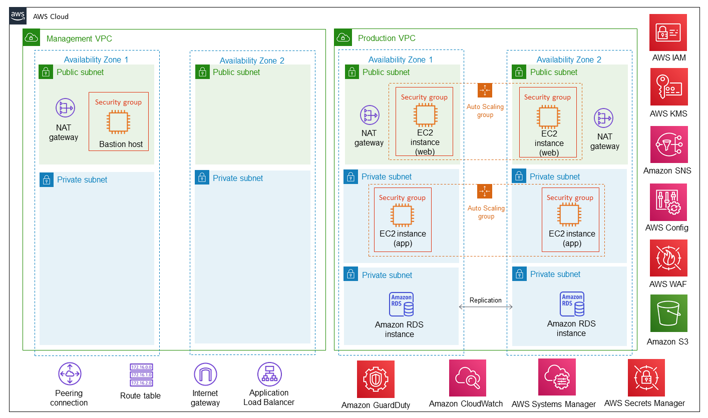

Deploying this Quick Start template builds the following AWS Cloud architecture to meet the key requirements of {partner-product-name} controls. It configures AWS security services for critical data and infrastructure.

// Replace this example diagram with your own. Send us your source PowerPoint file. Be sure to follow our guidelines here : http://(we should include these points on our contributors giude)
:xrefstyle: short
[#architecture1]
.Quick Start architecture for {partner-product-short-name} on AWS

As shown in <<architecture1>>, the Quick Start sets up the following:

* A multi-service Availability Zone (AZ) architecture with management and production virtual private networks (VPC).
* In the management VPC:
** AWS-managed network address translation (NAT) gateways to control public network access by the resources in the private subnets.
** A bastion host in a public subnet that provides system administrator access and connection via Secure Shell (SSH) for troubleshooting Amazon Elastic Compute Cloud (Amazon EC2) instances. The bastion host is assigned an Elastic IP address (EIP).
* In the production VPC:
** AWS-managed NAT gateways to control public network access by the resources in the private subnets.
** Web and application instances with public (front-end) and private (back-end) subnets for web, application, and database layers.
** A redundant Amazon Relational Database Service (Amazon RDS) database in a multi-AZ configuration.
** Separate Auto Scaling groups for web and application instances to secure high availability, and a three-tier web application (WordPress) that supports load balancing with Application Load Balancer.
* Standard security groups for Amazon EC2 instances.
* Default AWS Identity and Access Management (IAM) configurations that include groups, roles, and instance profiles as well as customizable IAM policies.
* AWS Key Management Service (AWS KMS) for AWS CloudTrail and Amazon RDS key encryption.
* Amazon GuardDuty to identify external intrusion threats.
* Notification policies based on Amazon Simple Notification Service (Amazon SNS) topics to capture Amazon RDS CPU and storage alarms.
* AWS Config rules to monitor security policies and compliance.
* An AWS WAF that creates response rules (Core Rule, WordPress, Application, SQL database, PHP application) automatically against the top 10 Open Web Application Security Project (OWASP) vulnerabilities.
* Amazon S3 buckets for centralized logging and AWS WAF.
* Amazon CloudWatch metric filters and alarms to monitor various aspects of the infrastructure, including the reliability, availability, and performance of Amazon RDS.
* Amazon CloudWatch alarms to trigger Amazon SNS topics and send email notifications.
* AWS Systems Manager for managing Amazon Machine Images (AMI) and keeping them current.  
* AWS Secrets Manager for creating and rotating the database password. 
