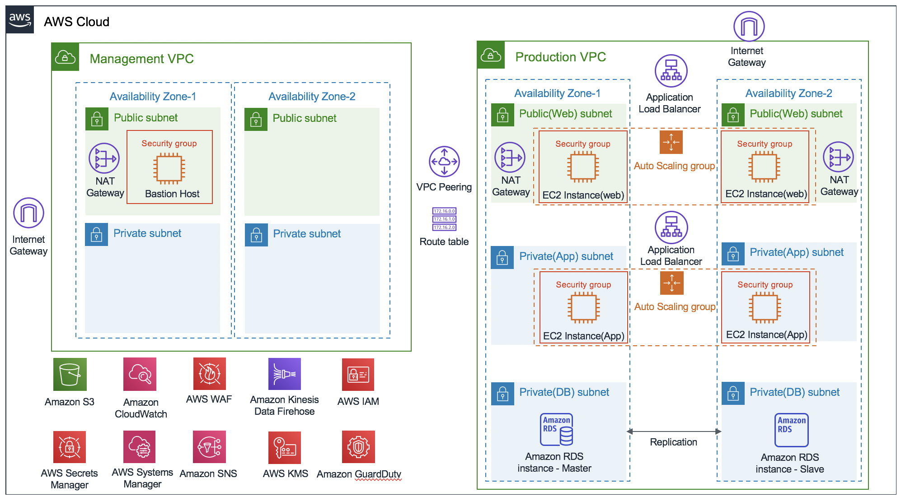

Deploying this Quick Start template builds the following AWS cloud architecture that achieves the key requirements of ISMS-P controls. It configures AWS security services and delivers essential security for critical data and infrastructure.

// Replace this example diagram with your own. Send us your source PowerPoint file. Be sure to follow our guidelines here : http://(we should include these points on our contributors giude)
:xrefstyle: short
[#architecture1]
.Quick Start architecture for {partner-product-short-name} on AWS

As shown in <<architecture1>>, the Quick Start sets up the following:

* A multi-service Availability Zone (AZ) architecture with management and production VPCs
** In the management VPC, a bastion host in a public subnet that enables system administrator access and connection via Secure Shell (SSH) for troubleshooting EC2 instances.
** In the production VPC, web and application instances with public (front-end) and private (back-end) subnets for web, application, and database layers.
* Standard security groups for EC2 instances.
* Default AWS Identity and Access Management configurations that include groups, roles, and instance profiles as well as customizable IAM policies.
* AWS Key Management Service (KMS) for CloudTrail and RDS key encryption.
* Rules to examine encryption policies.
* Amazon GuardDuty to identify external intrusion threats.
* Notification policies based on SNS topics to capture RDS CPU/Storage alarms.
* AWS Config rules to monitor security policies and compliance.
* An AWS WAF that creates response rules (Core Rule, WordPress, Application, SQL database, PHP application) automatically against the top tem Open Web Application Security Project (OWASP) vulnerabilities.
* Separate Auto Scaling groups for web and application instances to secure high availability, and a three-tier web application (WordPress) that supports Application Load Balancers.
* S3 buckets for centralized logging and AWS WAF.
* A redundant Amazon Relational Database Service (RDS) database in a multi-AZ configuration.
* AWS-managed network address translation (NAT) gateways to control public network access by the resources in the private subnets.
* 11 CloudWatch metric filters and alarms with following topics:
** https://docs.aws.amazon.com/awscloudtrail/latest/userguide/cloudwatch-alarms-for-cloudtrail.html#cloudwatch-alarms-for-cloudtrail-s3-bucket-activity[Amazon
S3 bucket activity]
** https://docs.aws.amazon.com/awscloudtrail/latest/userguide/cloudwatch-alarms-for-cloudtrail.html#cloudwatch-alarms-for-cloudtrail-security-group[Security
Group configuration changes]
** https://docs.aws.amazon.com/awscloudtrail/latest/userguide/cloudwatch-alarms-for-cloudtrail.html#cloudwatch-alarms-for-cloudtrail-network-acl[Network
Access Control List (ACL) changes]
** https://docs.aws.amazon.com/awscloudtrail/latest/userguide/cloudwatch-alarms-for-cloudtrail.html#cloudwatch-alarms-for-cloudtrail-gateway-changes[Network
cateway changes]
** https://docs.aws.amazon.com/awscloudtrail/latest/userguide/cloudwatch-alarms-for-cloudtrail.html#cloudwatch-alarms-for-cloudtrail-vpc-changes[Amazon
Virtual Private Cloud (VPC) changes]
** https://docs.aws.amazon.com/awscloudtrail/latest/userguide/cloudwatch-alarms-for-cloudtrail.html#cloudwatch-alarms-for-cloudtrail-ec2-instance-changes[Amazon
EC2 instance changes]
** https://docs.aws.amazon.com/awscloudtrail/latest/userguide/cloudwatch-alarms-for-cloudtrail.html#cloudwatch-alarms-for-cloudtrail-ec2-large-instance-changes[EC2
Large instance changes]
** https://docs.aws.amazon.com/awscloudtrail/latest/userguide/cloudwatch-alarms-for-cloudtrail.html#cloudwatch-alarms-for-cloudtrail-cloudtrail-changes[CloudTrail
changes]
** https://docs.aws.amazon.com/awscloudtrail/latest/userguide/cloudwatch-alarms-for-cloudtrail.html#cloudwatch-alarms-for-cloudtrail-signin[Console
sign-in failures]
** https://docs.aws.amazon.com/awscloudtrail/latest/userguide/cloudwatch-alarms-for-cloudtrail.html#cloudwatch-alarms-for-cloudtrail-authorization-failures[Authorization
failures]
** https://docs.aws.amazon.com/awscloudtrail/latest/userguide/cloudwatch-alarms-for-cloudtrail.html#cloudwatch-alarms-for-cloudtrail-iam-policy-changes[IAM
policy changes]
* 4 CloudWatch alarms to monitor the reliability, availability, and performance of Amazon RDS. CloudWatch alarms trigger Amazon SNS topics and send email notifications.